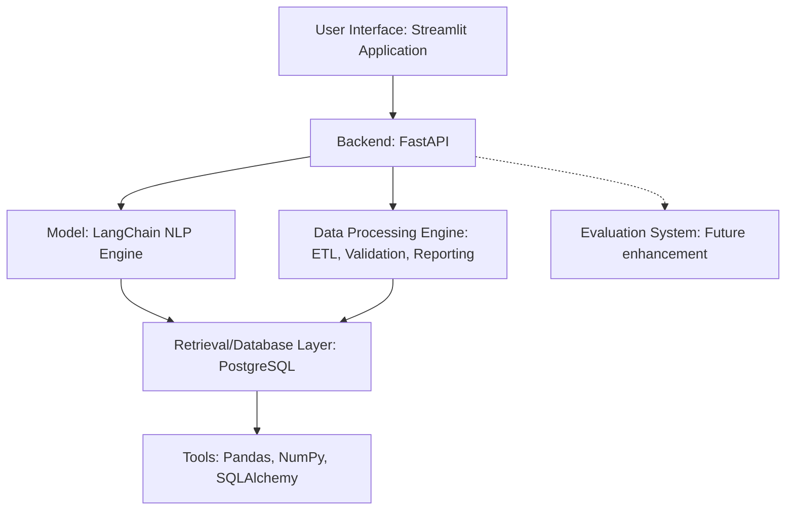

# Data Analytics AI Agent

A data analytics tool that automates the entire data lifecycle — from data ingestion to transformation, querying, visualization, and reporting using natural language.

## Problem
Data analysts and business professionals often spend too much time on repetitive tasks like cleaning data, writing complex SQL queries, and building manual reports. Non-technical users struggle to extract insights from raw data without relying on engineering teams.

## Solution
This system provides an end-to-end automation tool that allows users to ingest data, automatically clean it, and query it using natural English. It translates natural language to SQL, generates instant visualizations, and creates automated reports, empowering users of all technical levels to gain insights quickly.

## Architecture


## Main Features
- **Multi-Source Data Input**: Supports CSV/XLSX file uploads, API connections, and direct database linking.
- **Automated ETL Pipeline**: Cleans, validates, and transforms datasets to ensure data quality and schema consistency.
- **NLP-Based SQL Querying**: Query datasets using plain English, which gets converted into SQL queries.
- **Dynamic Visualization**: Generate interactive charts and plots instantly.
- **Automated Reporting**: Export insights as downloadable PDF or CSV reports.
- **Governed Workflows**: Modular backend design for secure and auditable data operations.

## Tech Stack
- **Python**: Core programming language for data manipulation and backend logic.
- **FastAPI**: Provides a fast, scalable API layer for handling data flows and NLP requests.
- **Streamlit**: Enables rapid development of interactive and user-friendly web interfaces.
- **PostgreSQL**: Robust, relational database for structured storage and SQL query execution.
- **Pandas & NumPy**: Essential libraries for efficient data manipulation, cleaning, and mathematical operations.
- **SQLAlchemy**: ORM for secure and flexible database connections and management.
- **LangChain**: Powers the NLP-to-SQL translation, making data querying accessible via natural language.
- **Docker**: For easy containerization and reproducible environments.

## Dataset
*(This project works with user-provided datasets, but here is a general overview of data handling)*
- **Source:** User-uploaded CSV/XLSX files, API endpoints, or direct database connections.
- **Cleaning:** Automated via the ETL pipeline which handles missing values, schema validation, and formatting.
- **Privacy Limitations:** Since data is uploaded by users, the system relies on the local environment or secure backend deployment to ensure privacy. RBAC is planned for governed environments.

## Evaluation
*(Metrics below are placeholders to be updated based on specific model deployment)*
- **Test dataset size:** TBD
- **Metrics:** SQL Query Accuracy (Execution Success Rate), Data Cleaning Completeness.
- **Baseline:** Manual SQL querying and manual data cleaning via Pandas.
- **Final results:** TBD
- **Failure cases:** Complex nested SQL queries may sometimes be misinterpreted by the NLP engine; highly unstructured data might fail automated ETL validations.

## Installation

### Using Docker (Recommended)
You can easily run this application without installing Python locally:
1. Ensure you have Docker and Docker Compose installed.
2. Clone the repository and navigate into it.
3. Run the following command:
```bash
docker-compose up -d
```
The application will be available at `http://localhost:8501`.

### Local Development
1. Clone the repository.
2. Create and activate a virtual environment.
3. Install dependencies:
```bash
pip install -r requirements.txt
pip install -r requirements-dev.txt
```
4. Run the Streamlit app:
```bash
streamlit run app.py
```

## Cost and Performance
*(Placeholders to be filled based on actual usage)*
- **Average latency:** < 2 seconds for basic NLP to SQL queries.
- **Average tokens:** Depends on the underlying LLM provider (e.g., OpenAI via LangChain).
- **Estimated cost:** Primarily driven by API costs of the LLM provider; local hosting reduces cost to infrastructure only.
- **Database size:** Scalable based on PostgreSQL storage limits.
- **Deployment setup:** Dockerized; Streamlit Cloud or GCP deployment planned for scalability.

## Limitations
- The NLP-to-SQL engine may struggle with highly complex, multi-join queries or ambiguous natural language requests.
- Automated cleaning might require manual intervention for highly irregular or dirty datasets.
- Currently lacks comprehensive Role-Based Access Control (RBAC) for enterprise environments.

## Future Improvements
- Streamlit Cloud or GCP deployment for scalable access.
- Role-Based Access Control (RBAC) for governed environments.
- Automated scheduling and reporting pipelines.
- Integration with BigQuery or Hive for big-data scalability.
- Improve evaluation system and add specific LLM benchmarking metrics.